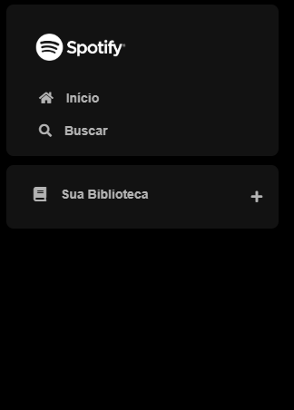
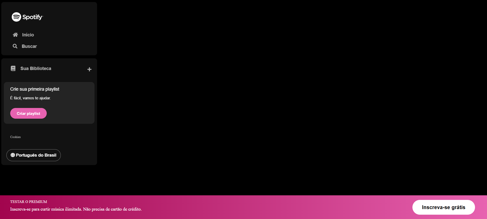
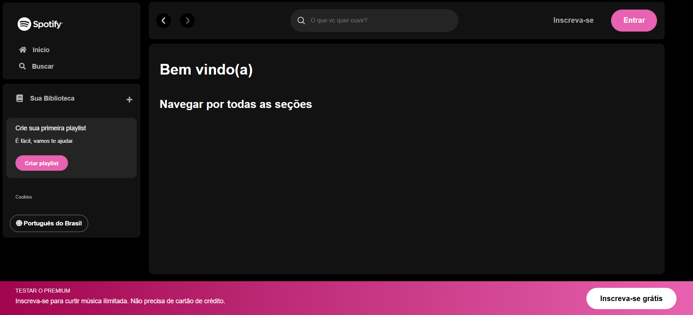

<h1 align="center"> Imersão Alura Front-End - Clone Spotify</h1>

Projeto em desenvolvimento durante a imersão Alura, onde o objetivo é replicar a interface do Spotify.

<br>

## Aula 1

Estruturação inicial utilizando `HTML` e `CSS`, para desenvolvimento da Nav.

<br>



<br>

## Aula 2

Continuação do desenvolvimento da Nav, e desenvolvimento do Footer, utilizando `HTML` e `CSS`.

<br>



<br>

## Aula 3

Início do desenvolvimento da Main e do Header de Navegação, utilizando `HTML` e `CSS`. Implementação de algumas pseudo-classes.

<br>



<br>

## Aula 4

Desenvolvimento dos Cards na Main, utilizando `HTML`, `CSS` e `JavaScript`. Trabalhando com Json (Api Fake).

<br>


https://github.com/user-attachments/assets/098ed334-0c59-4501-af72-fce661f0d092


<br>

# Acesso ao Projeto
Após clonar o projeto na sua máquina, você pode abrir o mesmo com Visual Code. 

Com o projeto aberto, execute o seguinte comando no terminal:

```sh
npm install
```

Execute o seguinte comando na raíz do projeto:

```sh
json-server --watch api-artists/artists.json --port 3000
```
Pronto, agora a nossa Api Fake está rodando. E você pode rodar o projeto com o Live Server no arquivo:

```sh
index.html
```

<br>


## Tecnologias Utilizadas

- `HTML`
- `CSS`
- `JavaScript`
- `React`
- `Angular`


<br>


## Autoria do Projeto

| [<br><sub>Daniele Tavares Lobo</sub>](https://github.com/danitavareslobo) |
| :----: |
